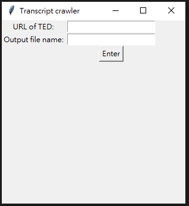

# TED Talks crawler
## Purpose
* crawl the transcript of the TED Talks video (https://www.ted.com/talks), and then output to a text file

## Use method
$ python ./craw_ted.py

In GUI  
  
put the URI and output file name, you can also contain folder path   
eg. /output/subtitle  
After pressing button Enter, you will see subtitle.txt in output folder

