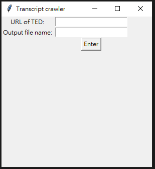

# TED Talks crawler
## Purpose
* crawl the transcript of the TED Talks video (https://www.ted.com/talks), and then output to a text file

## Prerequisites
Install following modules
* requests
* tkinter 
* openpyxl
* pyinstaller (if you need to generate exe file)
  

## Use method
### Method A. - Python 
$ python ./craw_ted.py

In GUI  
  
put the URI and output file name, you can also contain folder path   
eg. /output/subtitle  
After pressing button Enter, you will see subtitle.txt in output folder

### Method B. Generate Exe file from python file
Step 1. 
$ pyinstaller --onefile --windowed --distpath ./exe crawl_ted.py

Step 2.
click execution file in ./exe folder

